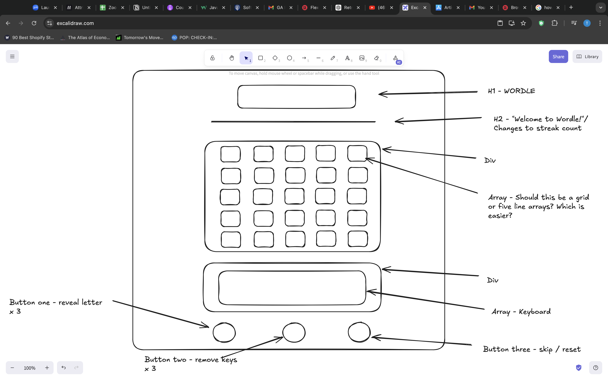

# Psuedocode

1. Init

- Select a random 5 letter word from a data pool - this word cannot be seen by the user
- Set the number of tries at 5
- Initialise a board array or 5 list arrays (not sure which is best yet) DONE

1. Playing the game
    
- User can guess 5 letter word using array(s)
- Game must confirm that the five letters form a real five letter word (how do I do this?? AI?)
- Check the user’s guess against the hidden word
- Loop through user’s guess checking each letter
- If correct letter and correct position change background to green
- If correct letter and wrong position change background to amber
- If letter is wrong change background to grey
- Show letter outcomes on keyboard array for visual reference (NTH)
- Show previous guess or guesses and their background colours
- Make sure that user cannot re-use arrays after they have been guessed in
- If the user guesses correctly display ‘You Win’ message
- If user wins, update score streak (NTH)
- If user guesses five times without success display ‘you lose’ message DONE
- Provide user with a button to reveal one of the letters, this must have limited use (NTH)
- Provide user with a button to grey out 3 of the letters on the keyboard array, this must have limited use (NTH)
    
    CAN WE MAKE THE WORDLE INSULT THE PLAYERS IF WE HAVE TIME? :P NTH but fun haha
    
2. Reset

- Add a reset button to start over and re-initialise
- Resetting without winning resets the score streak (NTH)
- If user wins game must reset but update the score streak (NTH)

NB. NTH = nice to have, ie. not MVP

# UI/UX

As a user I want to play Wordle!

As a user I want a clean and easy to use interface

As a user I want to see my score streak

As a user I want the game to generate a five letter word that I can’t see

As a user I want the game to let me guess the word within five attempts

As a user I want the game to provide me with an alphabet of letters that I can see

As a user I want to see five rows of five squares to place my letters in when I guess the word

As a user I would like to access these rows in order from 1 to 5

As a user I want the rows of squares to recognise if the letters I have placed spell the hidden word.

As a user if I do this I want the game to tell me that I have won! 🏆 

As a user when I have won I would like the game to congratulate me and update my win streak

As a user when I have won I would like the game to reset with a new hidden word but still keep my current win streak visible

As a user I would like my attempts to guess the words to stay in the rows and the squares I have selected

As a user I want the game to grey out any letters that I have put into squares that are not part of the hidden word on the keyboard and in the squares so that it is clear they are not in the word and so that I do not use them again

As a user I would like letters that are in the hidden word but are on the wrong square to turn amber (these letters can be dragged and dropped again)

As a user I would like letters that are in the hidden word and are on the correct square to turn green!

As a user I would like the above three things to occur only after I have contributed one full five letter word

As a user I do not want to be able to use a row of squares once I have contributed a five letter word attempt. I will have to use the next row.

As a user if I have not guessed the hidden word within five attempts I would like the game to tell me that I have lost 😠 

As a user if I have lost I would like the game to reset my win streak to 0

As a user I would like to use a button to reveal one of the letters in the hidden word and where it is placed (this button should be available x3)

As a user I would like to use a button to grey out three of the letters on the keyboard that are NOT part of the hidden word (this button should be available x3)

As a user I would like to use a button to reset the game and set my win streak to 0 (this button is always available)

As a user I would like the page to look pretty and symmetrical

As a user I would like the page to comply with Accessibility Standards